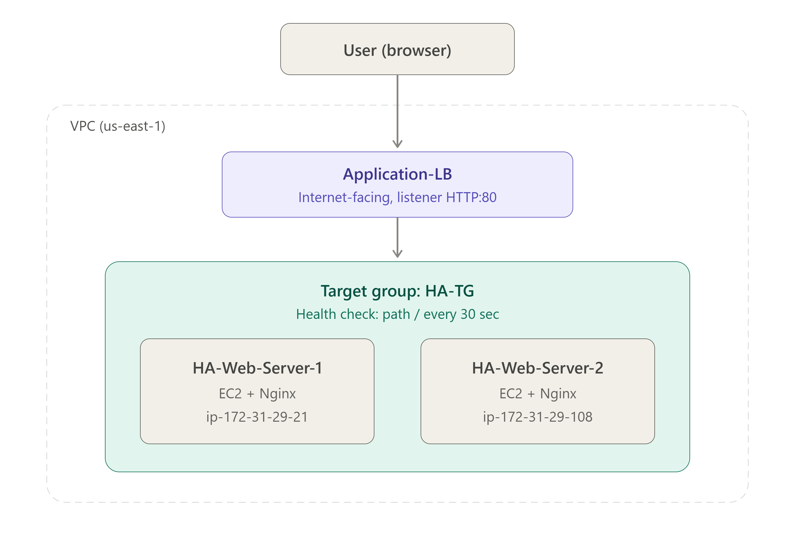
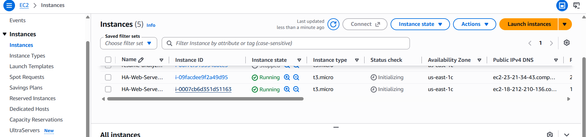
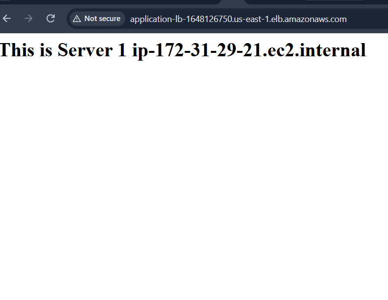
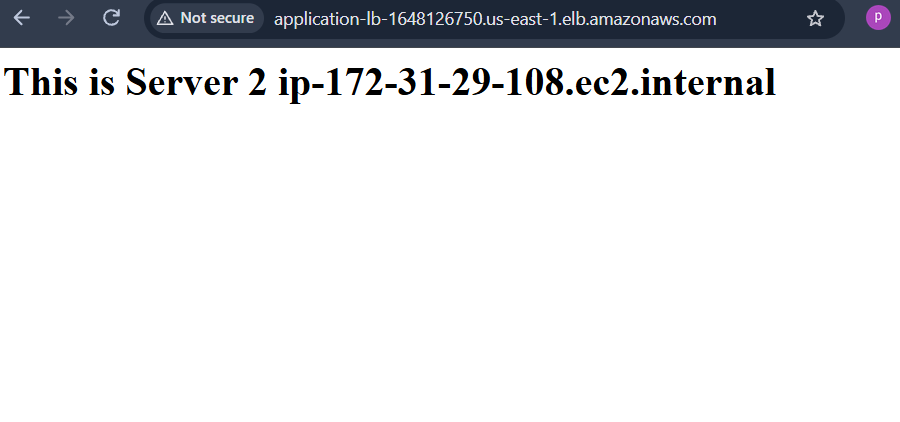
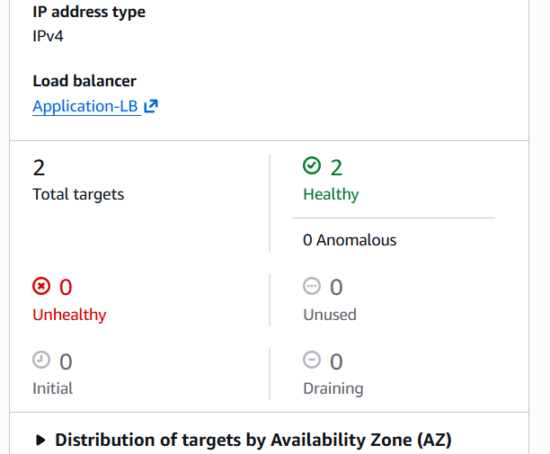
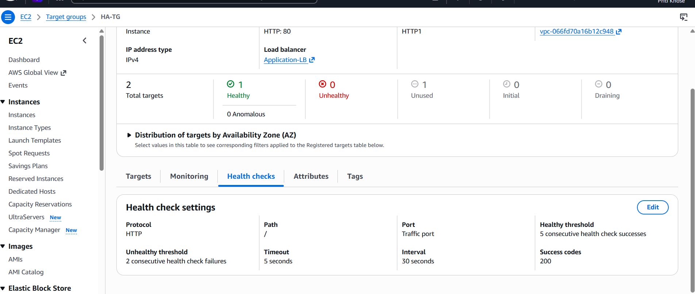
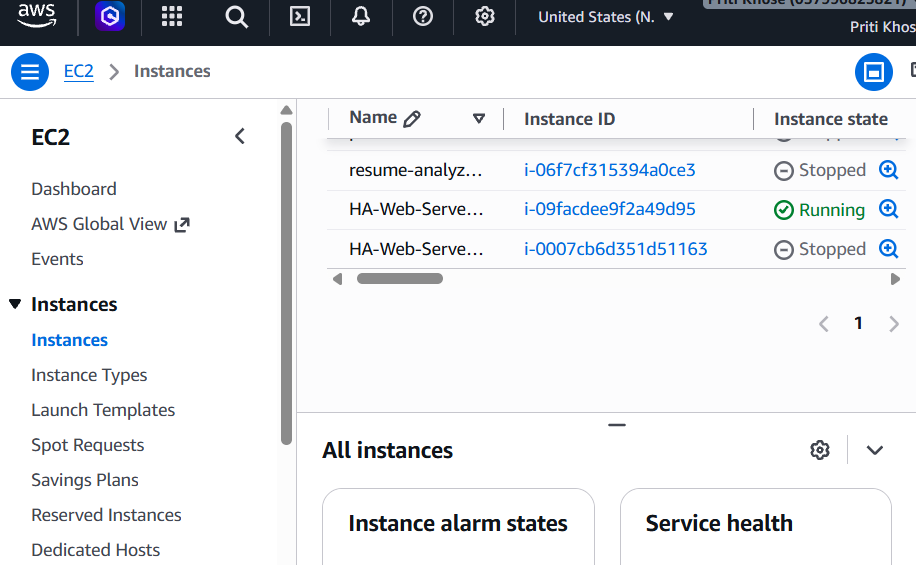
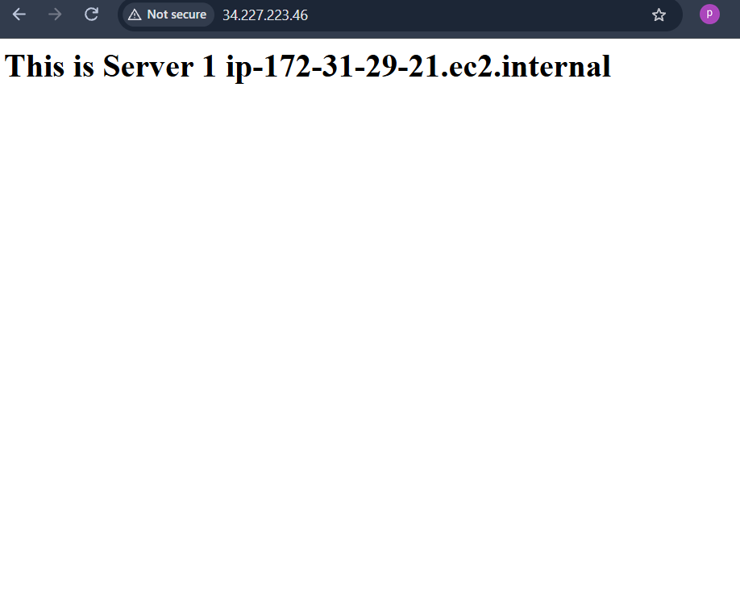

# Q2 – Highly Available Web Application Using an AWS Load Balancer

## Project overview

This project demonstrates a highly available web application in the **US East (N. Virginia), `us-east-1`** region. An **Application Load Balancer (ALB)** distributes HTTP requests across two Amazon EC2 web servers running Nginx.

Both instances are registered with one target group. The ALB uses target health checks and sends requests to healthy targets.

## Architecture



## AWS services and components

- Amazon EC2 (Amazon Linux)
- Application Load Balancer
- Target group
- Security groups
- Nginx

## Step 1: Create the EC2 web servers

Two EC2 instances were created:

- **HA-Web-Server-1**
- **HA-Web-Server-2**



Nginx was installed on each instance with User Data.

**Server 1 User Data**

```bash
#!/bin/bash
yum update -y
yum install nginx -y
systemctl start nginx
systemctl enable nginx
echo "<h1>This is Server 1 $(hostname)</h1>" > /usr/share/nginx/html/index.html
```

**Server 2 User Data**

```bash
#!/bin/bash
yum update -y
yum install nginx -y
systemctl start nginx
systemctl enable nginx
echo "<h1>This is Server 2 $(hostname)</h1>" > /usr/share/nginx/html/index.html
```

## Step 2: Create the target group

- **Name:** `HA-TG`
- **Target type:** Instances
- **Protocol and port:** HTTP : 80
- **Health check path:** `/`
- **Registered targets:** HA-Web-Server-1 and HA-Web-Server-2


## Step 3: Create the Application Load Balancer

- **Name:** `Application-LB`
- **Type:** Application Load Balancer
- **Scheme:** Internet-facing
- **Listener:** HTTP : 80
- **Forward action:** `HA-TG`


## Step 4: Test traffic distribution

The ALB DNS name was opened in a browser. Requests reached both web servers, and the target group reported two healthy targets.







## Step 5: Failover test

One EC2 instance was stopped to test failover. After the target group's health status updated, one target should remain healthy and continue serving requests through the ALB. The stopped instance was then started again; after recovery, both targets should become healthy.









## Security groups

The web servers must accept HTTP traffic on port **80** from the ALB security group. The ALB security group must allow inbound HTTP traffic on port **80** from the intended clients. Add SSH (port **22**) only if it was enabled and used; the available project details do not confirm an SSH rule.

## Result

The design is intended to keep the web application available when one target becomes unhealthy: the ALB routes requests to the remaining healthy target. The failover result should be considered demonstrated once the target-group and browser screenshots above have been added.

## What I learned

- How to configure EC2 web servers with Nginx
- How to register EC2 instances in a target group and use health checks
- How to create an Application Load Balancer
- How an ALB distributes traffic and routes around unhealthy targets